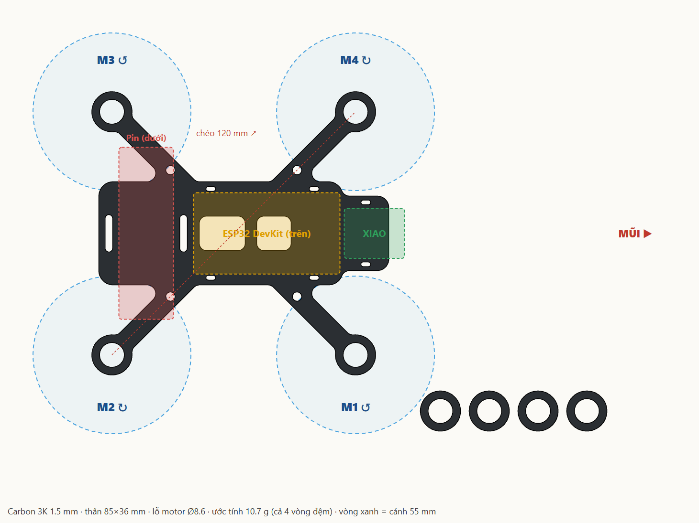

# Khung carbon 120 mm cho motor 8520

- `frame-120.dxf` — gửi xưởng cắt CNC. Đơn vị mm, layer `CUT`, gồm khung + 4 vòng đệm motor.
- Vật liệu: tấm carbon 3K dày **1,5 mm**. Dao phay 1 mm. Nặng khoảng 10,7 g.
- Motor 8520: quấn 1 lớp gen co nhiệt quanh thân rồi ấn vào lỗ Ø8,6 mm. Dán vòng đệm dưới vành để phần ôm cao 3 mm.
- Cánh 55 mm. Nhìn từ trên: M1 trước phải ↺, M2 sau phải ↻, M3 sau trái ↺, M4 trước trái ↻.
- Đổi thông số (chéo, độ dày, lỗ motor): sửa đầu file `make_frame.py` rồi chạy `python make_frame.py` (cần `pip install shapely ezdxf`).

Bụi carbon độc: cắt, mài phải đeo khẩu trang, làm ướt khi mài.
